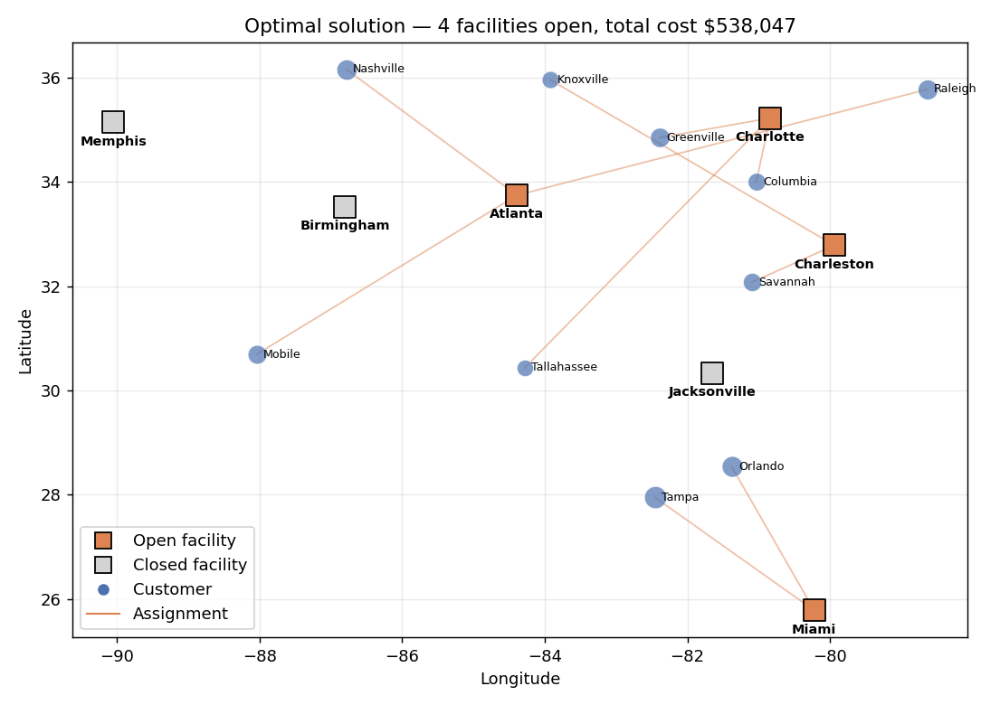
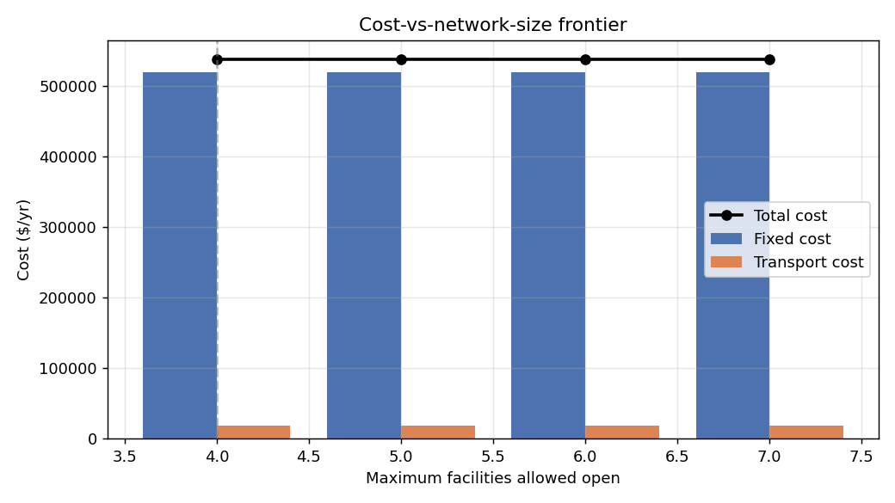

# Capacitated Facility Location Optimizer

**[Live demo](https://mason-facility-location.streamlit.app/)** : runs in the browser, no install required.

An end-to-end **distribution network design** project that decides which
distribution centres to open and how to route customer demand through them so
total annual cost is minimised. Tackled as a single-sourcing **Capacitated
Facility Location Problem (CFLP)**, a mixed-integer linear program, and
shipped with three layers of access:

1. A **PuLP-based Python module** (`facility_location.py`) that solves any
   network you give it via a clean dataclass API.
2. An **executed Jupyter notebook** that walks through the example network
   step by step (load → visualise → solve → sensitivity → what-if).
3. An **interactive Streamlit dashboard** where you can edit the facility
   and customer tables in the browser, drop in your own coordinates, change
   transport rates, force facilities open or closed, and re-solve in real
   time on a folium map.

No solver licence required : the model uses **CBC**, which ships with PuLP.



## The example network

The bundled `facility_data.xlsx` describes a realistic US-Southeast distribution
network:

**7 candidate facilities** (annual fixed cost & capacity):

| City | Lat / Lon | Fixed cost ($/yr) | Capacity (units/yr) |
|---|---|---:|---:|
| Charlotte, NC | 35.23, -80.84 | 130,000 | 200 |
| Jacksonville, FL | 30.33, -81.66 | 125,000 | 180 |
| Miami, FL | 25.78, -80.22 | 145,000 | 220 |
| Atlanta, GA | 33.75, -84.39 | 150,000 | 250 |
| Memphis, TN | 35.15, -90.05 | 120,000 | 160 |
| Charleston, SC | 32.79, -79.94 | 95,000 | 130 |
| Birmingham, AL | 33.52, -86.80 | 115,000 | 150 |

Total candidate capacity: **1,290 units/yr**.

**10 customer cities** (Nashville, Tampa, Orlando, Raleigh, Savannah, Columbia,
Mobile, Knoxville, Tallahassee, Greenville) with annual demands ranging from 55
to 110 units, totalling **785 units/yr**. The capacity slack (~500 units) is
intentional : the optimiser can choose to open a smaller subset.

**Transport costs** are derived from great-circle distance between facility
and customer, multiplied by a road-distance factor (1.3) and a unit transport
rate (default $0.05 / unit / km). Both rates are exposed in the dashboard.

## Model

**Decision variables**

| Variable | Type | Meaning |
|---|---|---|
| `y_i` | binary | Open facility *i* (1) or not (0) |
| `x_ij` | binary | Customer *j* fully served by facility *i* (single-sourcing) |

**Objective**

$$\min\; \sum_i f_i \, y_i \;+\; \sum_i \sum_j c_{ij} \, d_j \, x_{ij}$$

**Constraints**

| | |
|---|---|
| Each customer assigned exactly once | `Σ_i x_ij = 1  ∀ j` |
| Capacity (also forces `x_ij = 0` when `y_i = 0`) | `Σ_j d_j x_ij ≤ cap_i y_i  ∀ i` |
| Tighter LP-relaxation linkage | `x_ij ≤ y_i  ∀ i, j` |

The third row isn't algebraically required (it follows from the second when
`d_j > 0`) but it tightens the LP relaxation enough that CBC closes the
example to optimality in roughly 100 ms.

## Optimal solution (example network)

| Metric | Value |
|---|---:|
| Total annual cost | **$538,000** |
| Fixed cost | $520,000 (97 %) |
| Transport cost | $18,000 (3 %) |
| Facilities open | **4 of 7** : Charlotte, Miami, Atlanta, Charleston |
| Facilities closed | Jacksonville, Memphis, Birmingham |
| Solve time | ~100 ms (CBC) |



The cost-vs-network-size sweep shows opening fewer than 4 facilities is
infeasible (the remaining capacity falls below total demand) and opening
more than 4 just adds fixed cost without buying meaningful transport
savings at the example transport rate.

## Repository layout

```
.
├── facility_location_optimization.ipynb   ← walkthrough notebook (load → solve → sensitivity)
├── facility_location.py                   ← CFLP solver module (PuLP, no licence)
├── facility_location_app.py               ← Streamlit dashboard
├── build_dataset.py                       ← regenerate facility_data.xlsx from a Python config
├── facility_data.xlsx                     ← example network (Facilities / Customers / Transport Costs)
├── network_candidates.png, network_solution.png,
│   sensitivity_max_open.png               ← figures from the notebook
├── requirements.txt
└── README.md
```

## Run it

### Notebook walkthrough

```bash
pip install -r requirements.txt
jupyter notebook facility_location_optimization.ipynb
```

### Interactive dashboard

```bash
streamlit run facility_location_app.py
```

The dashboard opens at `http://localhost:8501`. From there you can:

- Edit the Facilities and Customers tables directly (add rows, change
  coordinates, demand, capacity, fixed cost).
- Adjust the **maximum number of facilities that can be opened**.
- **Force-open** or **force-close** specific facilities (useful for
  modelling existing leases or sites that are off the table).
- Tune the unit transport rate and the road-distance factor.
- See the optimal network drawn on a folium map (open vs. closed
  facilities marked in colour, assignment lines coloured to the facility).
- Download the solution (assignments, facility loads, summary) as an Excel
  workbook.

### Programmatic use

```python
from facility_location import Network, solve

net = Network.from_excel("facility_data.xlsx")
sol = solve(net, max_open=4, forced_closed=["Atlanta"])

print(f"Open: {sol.open_facilities}")
print(f"Cost: ${sol.total_cost:,.0f}")
print(sol.assignments)
```

## Stack

Python · **PuLP** + **CBC** (free MILP solver) · pandas · matplotlib ·
**Streamlit** + **folium** (dashboard) · geopy (great-circle distances)
